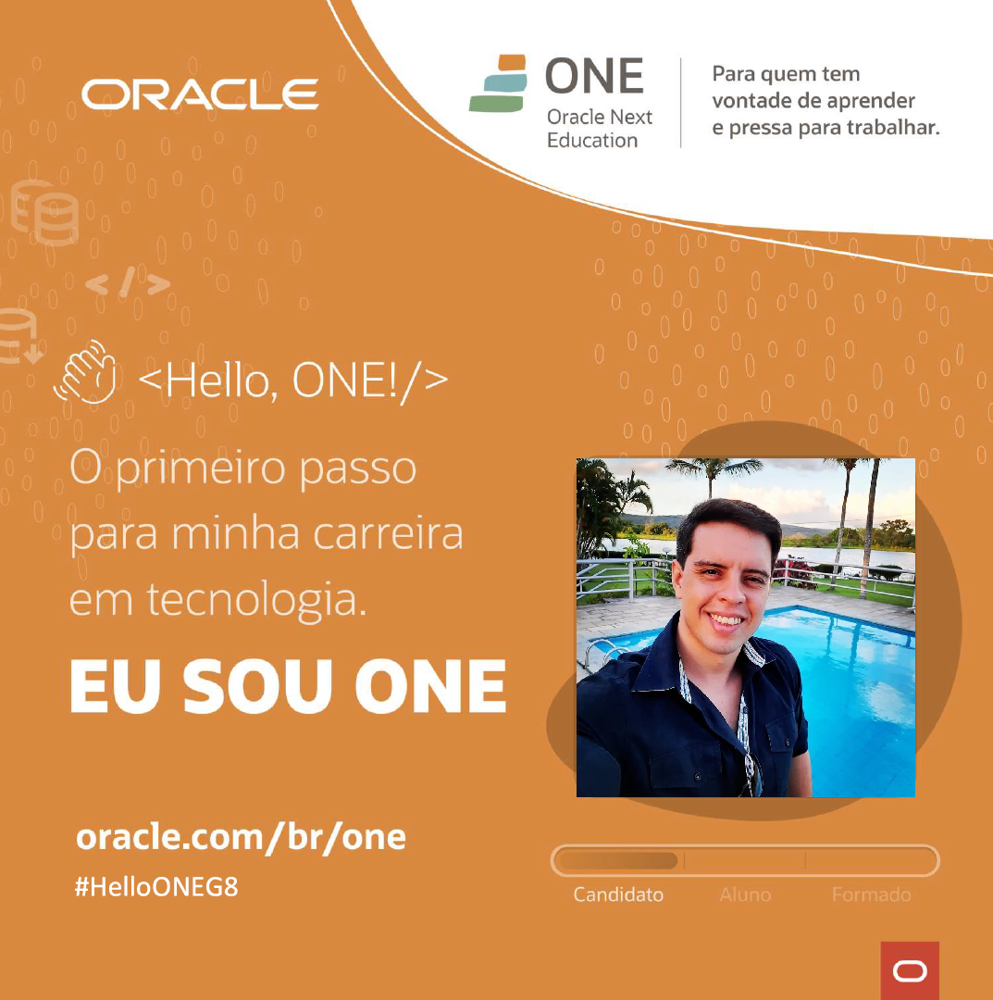
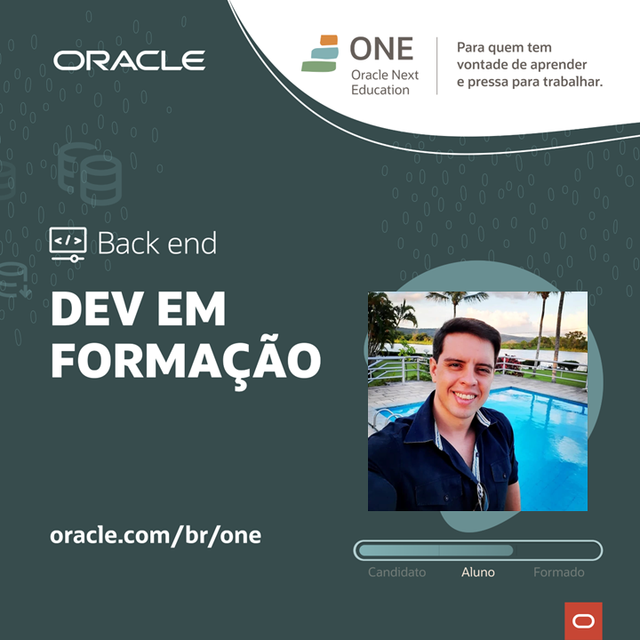

# ONE Oracle-Next-Education
 
## A tecnologia é para todos  
 
O ONE é um programa de educação e empregabilidade com objetivo social de capacitar pessoas em tecnologia e conectá-las com o mercado de trabalho por meio de empresas parceiras.
O curso é 100% online e totalmente gratuito, feito para quem não teve acesso à educação de qualidade e deseja transformar a sua realidade social.  
Esta formação faz parte do programa ONE, parceria de Alura + Oracle   

Parabéns, você passou para a fase de Especialização de Tech Foundation - Oracle Next Education! 🎉

TE DAMOS AS BOAS VINDAS À FASE DE ESPECIALIZAÇÃO DO PROGRAMA ONE - ORACLE NEXT EDUCATION: GRUPO 8!

### Saiba mais em https://www.oracle.com/br/education/oracle-next-education/