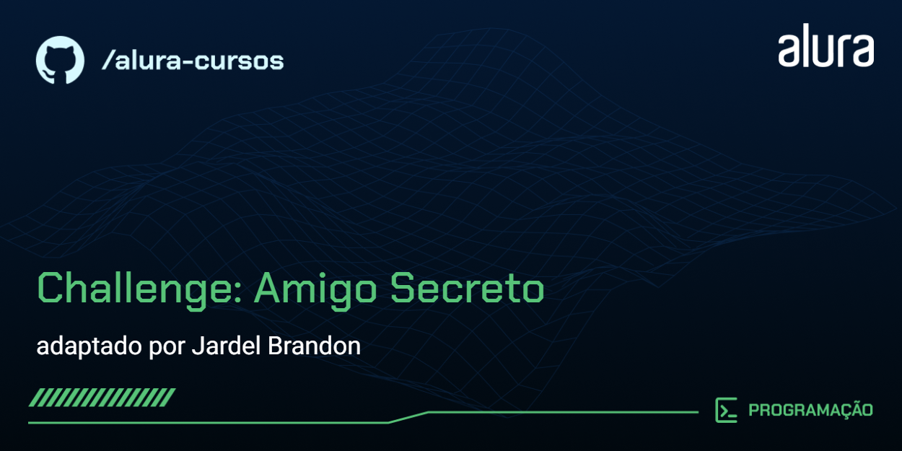

# Amigo Secreto

Site de simulação de um sistema de sorteio de retirada de nomes de amigos secretos para o challenge do ONE-Alura de iniciante me lógica de programação com javascript, html e css.

## 🔨 Funcionalidades do projeto

O App lista produtos com imagem, título, descrição e valor. Também, é possível cadastrar produtos. Todo armazenamento é mantido em memória do App, portanto, ao finalizar o App as informações são perdidas.

## ✔️ Técnicas e tecnologias utilizadas

As técnicas e tecnologias utilizadas pra isso são:

- `HTML`: Estruturação visual do sistema
- `CSS`: Estilização dos componentes gráficos da página
- `JavaScript`: Programação funcional do site
- `Fontes personalizadas`: configuração para adicionar novas fontes
- `Personalização de tema`: modificação de cores para o tema do projeto
- `Randomização`: Sorteio aleatório entre os nomes dos amigos
- `Classificação`: Categorização pelos nomes que serão sorteados, o nome sorteado e os nomes que já foram sorteados
- `Ordenação`: Organização dos nomes sorteados por ordem de retirada
- `Validação`: Verificação e alerta de inserção de nomes em branco e nomes repetidos 

## 🎯 Desafio

Tela de detalhes do produto

[Você pode conferir o quadro Kanban do desafio neste link do Trello](https://trello.com/b/pKFrkRfb/trello-challenge-amigo-secreto-pt#).

## 📁 Acesso ao projeto

Você pode [acessar o código fonte do projeto inicial](https://github.com/Oracle-Next-Education/challenge-amigo-secreto_pt) ou [baixá-lo em minhas versões](https://github.com/alura-cursos/android-com-kotlin-personalizando-ui/archive/refs/heads/projeto-inicial.zip).

## 🛠️ Abrir e rodar o projeto

Após baixar o projeto, você pode abrir e rodar em um navegador de sua preferência, executando apenas o arquivo index.html ou caso queira editar o projeto pode ser feito com o Visual Studio Code.

Para isso, na tela inicial do editor de código clique em:

- **Open Folder...** (ou alguma opção similar)
- Procure o local onde o projeto está e o selecione (Caso o projeto seja baixado via zip, é necessário extraí-lo antes de procurá-lo)
- Por fim clique em OK

O Visual Studio Code deve executar algumas rotinas de procedimentos padrões para configurar o projeto, aguarde até finalizar. Ao finalizar as rotinas, você pode executar ou editar o projeto 🏆 

## 👨‍💻 Desenvolvedor

<table>
  <tr>
    <td align="center"><a href="https://github.com/JardelBrandon"> <b>Jardel Brandon</b></a> <a href="https://github.com/JardelBrandon" title="Jardel">👨‍🚀</a></td>
  </tr>
</table>

## 📚 Mais informações do curso

Gostou do projeto e quer conhecer mais? Você pode [acessar o curso](https://cursos.alura.com.br/course/logica-programacao-challenge-amigo-secreto) que desenvolve o projeto desde o começo!

